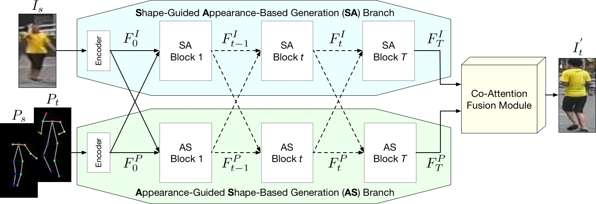
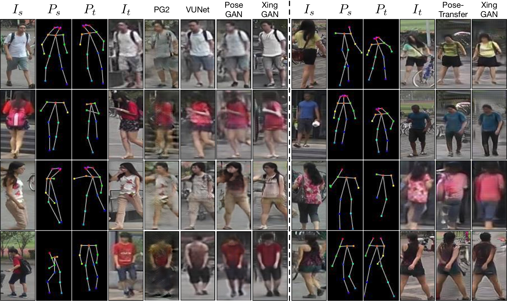
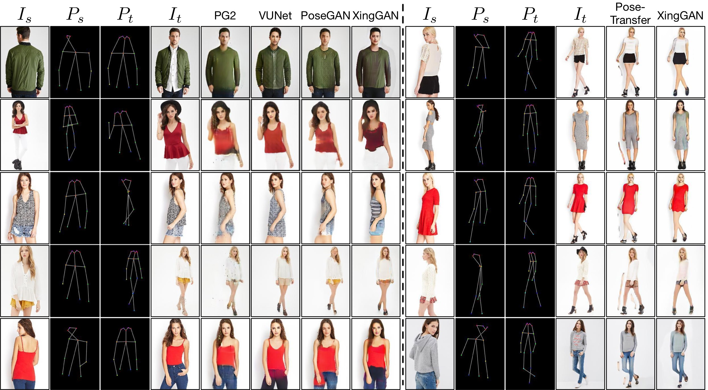

[](https://github.com/Ha0Tang/XingGAN/blob/master/LICENSE.md)


[]((https://github.com/Ha0Tang/XingGAN/graphs/commit-activity))


<!--  -->


## Contents
  - [XingGAN or CrossingGAN](#XingGAN-or-CrossingGAN)
  - [Installation](#Installation)
  - [Dataset Preparation](#Dataset-Preparation)
  - [Generating Images Using Pretrained Model](#Generating-Images-Using-Pretrained-Model)
  - [Train and Test New Models](#Train-and-Test-New-Models)
  - [Evaluation](#Evaluation)
  - [Acknowledgments](#Acknowledgments)
  - [Related Projects](#Related-Projects)
  - [Citation](#Citation)
  - [Contributions](#Contributions)
  - [Collaborations](#Collaborations)

## XingGAN or CrossingGAN
**| [Project](http://disi.unitn.it/~hao.tang/project/XingGAN.htm) | [Paper](https://arxiv.org/abs/2007.09278) |** <br> 
[**XingGAN for Person Image Generation**](https://arxiv.org/abs/2007.09278) <br> 
[Hao Tang](http://disi.unitn.it/~hao.tang/)<sup>12</sup>, [Song Bai](http://songbai.site/)<sup>2</sup>, [Li Zhang](http://www.robots.ox.ac.uk/~lz/)<sup>2</sup>, [Philip H.S. Torr](https://scholar.google.com/citations?user=kPxa2w0AAAAJ&hl=en)<sup>2</sup>, [Nicu Sebe](https://scholar.google.com/citations?user=stFCYOAAAAAJ&hl=en)<sup>13</sup>. <br> 
<sup>1</sup>University of Trento, Italy, <sup>2</sup>University of Oxford, UK, <sup>3</sup>Huawei Research Ireland, Ireland.<br>
In [ECCV 2020](https://eccv2020.eu/). <br>
The repository offers the official implementation of our paper in PyTorch.

In the meantime, check out our related ACM MM 2019 paper [Cycle In Cycle Generative Adversarial Networks for Keypoint-Guided Image Generation](https://github.com/Ha0Tang/C2GAN), BMVC 2020 oral paper [Bipartite Graph Reasoning GANs for Person Image Generation](https://github.com/Ha0Tang/BiGraphGAN), and ICCV 2021 paper [Intrinsic-Extrinsic Preserved GANs for Unsupervised 3D Pose Transfer](https://github.com/mikecheninoulu/Unsupervised_IEPGAN).

### Framework


### Comparison Results



<br>



### [License](./LICENSE.md)
<a rel="license" href="http://creativecommons.org/licenses/by-nc-sa/4.0/"></a><br />
Copyright (C) 2020 University of Trento, Italy.

All rights reserved.
Licensed under the [CC BY-NC-SA 4.0](https://creativecommons.org/licenses/by-nc-sa/4.0/legalcode) (**Attribution-NonCommercial-ShareAlike 4.0 International**)

The code is released for academic research use only. For commercial use, please contact [bjdxtanghao@gmail.com](bjdxtanghao@gmail.com).

## Installation

Clone this repo.
```bash
git clone https://github.com/Ha0Tang/XingGAN
cd XingGAN/
```

This code requires PyTorch 1.0.0 and python 3.6.9+. Please install the following dependencies:
* pytorch 1.0.0
* torchvision
* numpy
* scipy
* scikit-image
* pillow
* pandas
* tqdm
* dominate

To reproduce the results reported in the paper, you need to run experiments on NVIDIA DGX1 with 4 32GB V100 GPUs for DeepFashion, and 1 32GB V100 GPU for Market-1501.

## Dataset Preparation

Please follow [SelectionGAN](https://github.com/Ha0Tang/SelectionGAN/tree/master/person_transfer#data-preperation) to directly download both Market-1501 and DeepFashion datasets.

This repository uses the same dataset format as [SelectionGAN](https://github.com/Ha0Tang/SelectionGAN/tree/master/person_transfer#data-preperation) and [BiGraphGAN](https://github.com/Ha0Tang/BiGraphGAN). so you can use the same data for all these methods.

## Generating Images Using Pretrained Model
### Market-1501
```bash
sh scripts/download_xinggan_model.sh market
```
Then,
1. Change several parameters in `test_market.sh`.
2. Run `sh test_market.sh` for testing.

### DeepFashion
```bash
sh scripts/download_xinggan_model.sh deepfashion
```
Then,
1. Change several parameters in `test_deepfashion.sh`.
2. Run `sh test_deepfashion.sh` for testing.

## Train and Test New Models
### Market-1501
1. Change several parameters in `train_market.sh`.
2. Run `sh train_market.sh` for training.
3. Change several parameters in `test_market.sh`.
4. Run `sh test_market.sh` for testing.

### DeepFashion
1. Change several parameters in `train_deepfashion.sh`.
2. Run `sh train_deepfashion.sh` for training.
3. Change several parameters in `test_deepfashion.sh`.
4. Run `sh test_deepfashion.sh` for testing.

## Evaluation
We adopt SSIM, mask-SSIM, IS, mask-IS, and PCKh for evaluation of Market-1501. SSIM, IS, PCKh for DeepFashion. 
1. SSIM, mask-SSIM, IS, mask-IS: install `python3.5`, `tensorflow 1.4.1`, and `scikit-image==0.14.2`. Then run, `python tool/getMetrics_market.py` or `python tool/getMetrics_fashion.py`.

2. PCKh: install `python2`, and `pip install tensorflow==1.4.0`, then set `export KERAS_BACKEND=tensorflow`. After that, run `python tool/crop_market.py` or `python tool/crop_fashion.py`.
Next, download pose estimator and put it under the root folder, and run `python compute_coordinates.py`.
Lastly, run `python tool/calPCKH_market.py` or `python tool/calPCKH_fashion.py`.

Please refer to [Pose-Transfer](https://github.com/tengteng95/Pose-Transfer#evaluation) for more details.

 
## Acknowledgments
This source code is inspired by both [Pose-Transfer](https://github.com/tengteng95/Pose-Transfer) and [SelectionGAN](https://github.com/Ha0Tang/SelectionGAN).

## Related Projects
**[BiGraphGAN](https://github.com/Ha0Tang/BiGraphGAN) | [GestureGAN](https://github.com/Ha0Tang/GestureGAN) | [C2GAN](https://github.com/Ha0Tang/C2GAN) | [SelectionGAN](https://github.com/Ha0Tang/SelectionGAN) | [Guided-I2I-Translation-Papers](https://github.com/Ha0Tang/Guided-I2I-Translation-Papers)**

## Citation
If you use this code for your research, please consider giving a star :star: and citing our [paper](https://arxiv.org/abs/2007.09278) :t-rex::

XingGAN
```
@inproceedings{tang2020xinggan,
  title={XingGAN for Person Image Generation},
  author={Tang, Hao and Bai, Song and Zhang, Li and Torr, Philip HS and Sebe, Nicu},
  booktitle={ECCV},
  year={2020}
}
```

If you use the original [BiGraphGAN](https://github.com/Ha0Tang/BiGraphGAN), [GestureGAN](https://github.com/Ha0Tang/GestureGAN), [C2GAN](https://github.com/Ha0Tang/C2GAN), and [SelectionGAN](https://github.com/Ha0Tang/SelectionGAN) model, please consider giving stars :star: and citing the following papers :t-rex::

BiGraphGAN
```
@inproceedings{tang2020bipartite,
  title={Bipartite Graph Reasoning GANs for Person Image Generation},
  author={Tang, Hao and Bai, Song and Torr, Philip HS and Sebe, Nicu},
  booktitle={BMVC},
  year={2020}
}
```

GestureGAN
```
@article{tang2019unified,
  title={Unified Generative Adversarial Networks for Controllable Image-to-Image Translation},
  author={Tang, Hao and Liu, Hong and Sebe, Nicu},
  journal={IEEE Transactions on Image Processing (TIP)},
  year={2020}
}

@inproceedings{tang2018gesturegan,
  title={GestureGAN for Hand Gesture-to-Gesture Translation in the Wild},
  author={Tang, Hao and Wang, Wei and Xu, Dan and Yan, Yan and Sebe, Nicu},
  booktitle={ACM MM},
  year={2018}
}
```

C2GAN
```
@article{tang2021total,
  title={Total Generate: Cycle in Cycle Generative Adversarial Networks for Generating Human Faces, Hands, Bodies, and Natural Scenes},
  author={Tang, Hao and Sebe, Nicu},
  journal={IEEE Transactions on Multimedia (TMM)},
  year={2021}
}

@inproceedings{tang2019cycleincycle,
  title={Cycle In Cycle Generative Adversarial Networks for Keypoint-Guided Image Generation},
  author={Tang, Hao and Xu, Dan and Liu, Gaowen and Wang, Wei and Sebe, Nicu and Yan, Yan},
  booktitle={ACM MM},
  year={2019}
}
```

SelectionGAN
```
@inproceedings{tang2019multi,
  title={Multi-channel attention selection gan with cascaded semantic guidance for cross-view image translation},
  author={Tang, Hao and Xu, Dan and Sebe, Nicu and Wang, Yanzhi and Corso, Jason J and Yan, Yan},
  booktitle={CVPR},
  year={2019}
}

@article{tang2020multi,
  title={Multi-channel attention selection gans for guided image-to-image translation},
  author={Tang, Hao and Xu, Dan and Yan, Yan and Corso, Jason J and Torr, Philip HS and Sebe, Nicu},
  journal={arXiv preprint arXiv:2002.01048},
  year={2020}
}
```

## Contributions
If you have any questions/comments/bug reports, feel free to open a github issue or pull a request or e-mail to the author Hao Tang ([bjdxtanghao@gmail.com](bjdxtanghao@gmail.com)). 

## Collaborations
I'm always interested in meeting new people and hearing about potential collaborations. If you'd like to work together or get in contact with me, please email bjdxtanghao@gmail.com. Some of our projects are listed [here](https://github.com/Ha0Tang).
___
*Progress is impossible without change, and those who cannot change their minds cannot change anything.*
